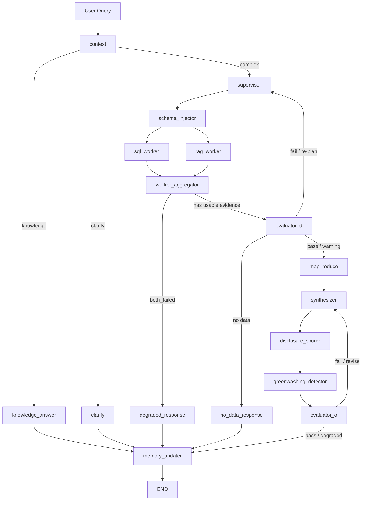

# ESG-Insight Agent 架构说明

> 用途：面试 / 复盘时快速讲清楚系统不是普通 RAG Demo，而是一个可观测、可评测、可降级的 ESG 分析 Agent。  
> 更新日期：2026-08-09

---

## 1. 一句话架构定位

**ESG-Insight Agent 使用 FastAPI + LangGraph 构建白盒化 ESG 报告分析工作流，通过 SQL + RAG 双通道获取证据，并在生成前后加入 Evaluator、披露质量评分与绿漂风险雷达。**

核心设计目标不是“让模型自由发挥”，而是把一个复杂 ESG 分析任务拆成可观测、可测试、可归因的节点。

---

## 2. 当前 LangGraph 主流程



面试讲法：

> 我没有采用一个大而全的 ReAct Agent，而是把任务拆成显式节点。这样每一步都可以记录 trace：是意图识别错了、SQL 没查到、RAG 召回偏了，还是最后生成幻觉了，都能定位。

---

## 3. 节点职责表

| 节点 | 作用 | 主要输入 | 主要输出 | 面试亮点 |
|---|---|---|---|---|
| `context` | 理解用户问题，抽取公司、年份、指标、任务类型 | `user_query` | `task_class`, `companies`, `years`, `metrics` | 避免所有问题都走重流程，支持 knowledge / clarify 快速出口 |
| `knowledge_answer` | 概念类问题直答 | `resolved_query` | `analysis` | 成本控制：概念问答不做 SQL/RAG |
| `clarify` | 信息不足时反问 | `clarify_question` | `analysis` | 不确定时不硬答 |
| `supervisor` | 制定执行计划 | context 结果、历史错误 | plan / worker 策略 | 可 re-plan，不是一次失败就结束 |
| `schema_injector` | 给 SQL Worker 注入数据库 schema | 当前任务实体 | schema prompt / table info | 降低 Text2SQL 表名字段错误 |
| `sql_worker` | 查询 SQLite ESG 指标库 | schema、公司、年份、指标 | `sql_result`, `sql_query_executed` | 结构化事实来源，适合数字与趋势 |
| `rag_worker` | 检索 ESG PDF 原文证据 | query、公司、年份、指标 | `rag_result`, `sources` | 非结构化证据来源，适合解释、承诺、页码 |
| `worker_aggregator` | 汇总 SQL/RAG 双路结果 | worker outputs | coverage status | 判断 both_ok / sql_only / rag_only / both_failed |
| `evaluator_d` | 生成前数据质量检查 | SQL/RAG 结果 | pass / warning / fail | 防止证据不足时硬生成 |
| `map_reduce` | 长文本压缩 | RAG chunks | compressed context | 控制上下文长度 |
| `synthesizer` | 生成最终分析报告 | 结构化数据 + 原文证据 | `analysis`, `key_findings` | 输出带证据的 ESG 分析，不是泛泛总结 |
| `disclosure_scorer` | 披露质量评分 | SQL/RAG/analysis | `disclosure_quality` | 业务亮点：把披露质量变成可解释分数 |
| `greenwashing_detector` | 强表述-弱证据风险识别 | RAG chunks / sources | `greenwashing_risks` | 业务亮点：输出人工核查点，不做武断定性 |
| `evaluator_o` | 生成后质量检查 | answer + evidence | `eval_o_status` | 检查数字事实性、实体一致性、趋势方向 |
| `degraded_response` | 双路失败时降级 | failure reason | safe answer | 可靠 Agent 要知道不能答什么 |
| `no_data_response` | 无数据场景安全响应 | missing summary | no-data answer | 区分“未披露 / 未覆盖 / 数值为 0” |
| `memory_updater` | 保存对话记忆 | final state | history | 支持多轮对话 |

---

## 4. 为什么是 SQL + RAG 双通道

ESG 报告分析同时有两类证据：

1. **结构化指标**：例如范围一排放、绿色贷款余额、研发投入、员工培训人数。这类问题适合 SQL 查询，便于排序、同比、跨公司对比。
2. **非结构化文本**：例如减排措施、绿色承诺、供应链管理描述、第三方鉴证说明。这类内容散落在 PDF 中，适合 RAG 检索。

单用 RAG 的问题：数字容易幻觉，横向对比不稳定。  
单用 SQL 的问题：只能回答“多少”，很难解释“为什么”和“证据在哪里”。

因此本项目采用：

```text
SQL 负责可计算事实
RAG 负责原文证据和语义解释
Evaluator 负责检查两者是否足够支持最终回答
```

---

## 5. 双层 Evaluator 的位置与意义

### 5.1 Evaluator-D：生成前检查

位置：`worker_aggregator → evaluator_d → map_reduce/supervisor`

检查重点：

- SQL 是否返回空；
- RAG 是否召回到相关段落；
- 公司 / 年份 / 指标是否覆盖用户问题；
- 是否需要 re-plan 或降级。

面试讲法：

> Evaluator-D 的价值是把错误拦在生成前。如果证据不足，系统宁可重试或降级，也不让模型基于空证据编答案。

### 5.2 Evaluator-O：生成后检查

位置：`greenwashing_detector → evaluator_o → memory_updater/synthesizer`

检查重点：

- 回答结构是否完整；
- 数字是否能在 SQL/RAG 证据中找到；
- 是否讨论了用户没问的公司或年份；
- 趋势方向是否和数据一致。

面试讲法：

> Evaluator-O 不是为了让模型“自我感觉良好”，而是把输出质量拆成可检查项，发现问题后局部修正。

---

## 6. 为什么新增两个业务节点

### 6.1 `disclosure_scorer` 放在 `synthesizer` 后

原因：披露质量评分需要综合 SQL 结构化覆盖、RAG 原文证据、最终分析中的缺失提示，因此放在报告初稿之后更自然。

评分维度：

| 维度 | 权重 | 含义 |
|---|---:|---|
| completeness | 30 | 是否披露核心指标 |
| continuity | 20 | 是否连续多年披露 |
| comparability | 20 | 是否口径一致、可横向比较 |
| verifiability | 20 | 是否有页码、原文、第三方鉴证等证据 |
| specificity | 10 | 是否具体到数字、年份、目标 |

### 6.2 `greenwashing_detector` 放在 `evaluator_o` 前

原因：绿漂风险雷达属于回答的一部分，也需要被最终质量检查覆盖。

当前第一版不判断“企业是否真实绿漂”，只识别：

```text
强 ESG 表述 + 附近缺少量化证据 / 年度进展 / 同比变化 / 第三方鉴证
= claim-evidence mismatch 人工核查点
```

这使输出更安全、更可解释，也更适合第一版评测。

---

## 7. 降级路径

本项目强调：**可靠 Agent 不是永远回答，而是知道何时不能回答。**

常见降级场景：

| 场景 | 系统行为 | 面试讲法 |
|---|---|---|
| 公司不在覆盖范围 | 走 no-data / degraded response | 不编造公司数据 |
| 年份未覆盖 | 明确说明覆盖缺口 | 缺失不等于 0 |
| SQL 和 RAG 都失败 | 降级输出 | 把失败暴露给用户 |
| 证据不足但可部分回答 | pass_with_warnings | 明确标注限制 |
| 输出质量检查失败 | 打回 synthesizer 局部修正 | 减少最终幻觉 |

---

## 8. 面试 60 秒架构讲法

> 这个项目的核心不是做一个 PDF QA，而是做一个可评测 ESG 分析 Agent。我用 LangGraph 把流程拆成 context、supervisor、SQL/RAG worker、worker aggregator、双层 evaluator、synthesizer、披露评分和绿漂风险识别等节点。SQL 负责结构化数字，RAG 负责 PDF 原文证据，Evaluator-D 在生成前检查证据是否足够，Evaluator-O 在生成后检查数字、实体和趋势是否忠实。最新我把披露质量评分和绿漂风险识别做成独立节点，前者用确定性 Rubric 打分，后者识别 strong claim 但缺少 evidence 的人工核查点。这样项目可以做到可观测、可降级、可评测，而不是一个黑盒 RAG Demo。

---

## 9. 代码入口

| 主题 | 文件 |
|---|---|
| 图结构 | `agent/graph.py` |
| 状态定义 | `agent/state.py` |
| API | `api/main.py` |
| 披露评分 | `agent/disclosure_quality.py`, `agent/nodes/disclosure_scorer.py` |
| 绿漂风险 | `agent/greenwashing.py`, `agent/nodes/greenwashing_detector.py` |
| 能力边界 | `agent/capabilities.py`, `/api/capabilities` |
| 前端 | `static/app.js`, `static/dashboard.html`, `static/style.css` |
| 测试 | `tests/` |
